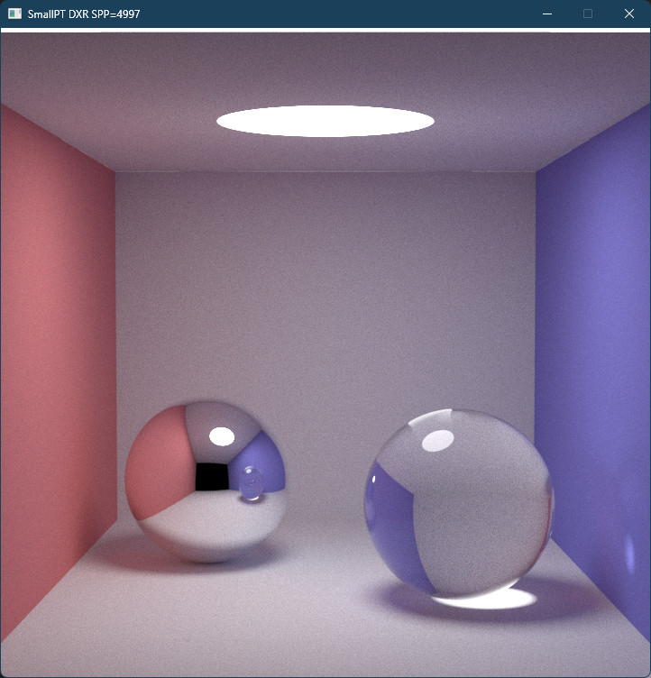

# SmallPT in DXR

* Ported the forward (non-recursive) traversal and shading loop to DXR 1.0.
* The scene is encoded in 1 `BLAS` with 1 `GEOMETRY` containing 8 `D3D12_RAYTRACING_AABB`s.
  * One could alternatively organize the scene into 8 `BLAS`s, each with its own `GEOMETRY` and instance transforms.
  * One could also organize the scene into 1 `BLAS` with 8 `GEOMETRY`s but this doesn't simplify things
	since `D3D12_RAYTRACING_AABB`s cannot be assigned instance transforms. Only `TRIANGLES`.